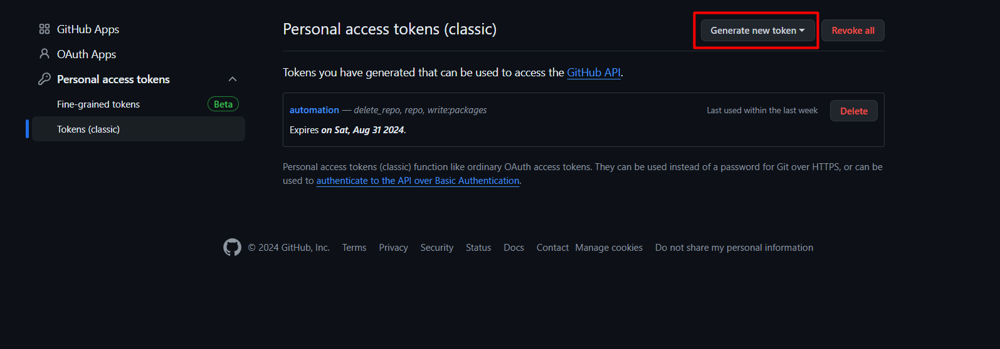
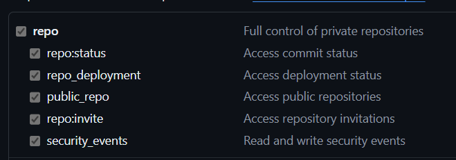
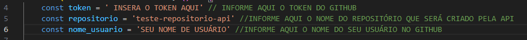

# Cypress Becomex

Este repositório serve para armazenar um projeto de automação feito em cypress, e2e e de api do GitHub, que foi solicitado pela Becomex para a vaga de Analista de Testes - Pleno.
O projeto foi separado em duas partes:
1. Dentro da pasta e2e possui os testes de interface e um arquivo .md informativo com: casos de testes e sugestão de melhoria;
2. Dentro da pasta api, possui todo o teste de api feito usando a api do GitHub.

----
## Configuração do ambiente

Para configurar o ambiente, afim de rodar a automação, é necessário instalar algumas dependências:

1. [VSCode](https://code.visualstudio.com/Download): IDE que será usada;
2. [Node](https://nodejs.org/en/download/package-manager): para instalar as dependencia do javascript do projeto.

Após instalar as ferramentas solicitadas, é necessário fazer o git clone do projeto em alguma pasta do sua escolha.

1. Criar uma pasta no caminho de sua escolha, exemplo: **C:\Documents\workspace**
2. Abrir o CMD no caminho da pasta criada
3. Rodar o seguinte comando: **git clone https://github.com/AnaStadelhofer/A-BecomexCypress.git**
4. Acessar a pasta que foi criada com o projeto dando: **cd A-BecomexCypress**
5. Rodar o comando para abrir o Visual Code: **code .**
6. Rodar o comando **npm install**

## Configurar o token do GitHub

Para executar os testes de api, é necessário ter uma conta no GitHub e ter um token configurado. Para criar um token basta acessar o [link](https://github.com/settings/tokens/) e clicar em "Generate new token". 

Após isso é necessário preencher algumas permissões do token, tais como: 'repo' e 'delete_repo' conforme os prints.

!!! e É de extrema importância essa parte, pois se não os testes não irão funcionar!

Por fim, vamos para última etapa de configuração que é a alteração do token e o nome de usuário. Para isso, abra o arquivo cypress/e2e/api/api.cy.js e altere as seguintes informações: Nome_usuário e token (que foi gerado nos passos acima).

----
# Executar o projeto

Após o projeto estar todo configurado, conforme descrito nos passos acima, basta apenas executar agora, para isso é preciso rodar o comando: **npx cypress open**.

Depois de rodar o comando, ele irá abrir uma tela para selecionar qual o navegador para executar os testes automatizados, de preferencia escolha o Chrome, pois foi desenvolvido nele.

